<div align="center">

# Cosmos-Dreams-AlpaSim

### 基于 NVIDIA OmniDreams 的自动驾驶闭环仿真
### 真实场景闭环 × 反事实长尾场景生成

**Closed-Loop Autonomous-Driving Simulation with NVIDIA OmniDreams —<br>Real-Scene Rollouts & Counterfactual Long-Tail Scenario Generation**

<br>

[](https://arxiv.org/pdf/2606.03159)
[](https://github.com/nv-tlabs/omni-dreams)
[](LICENSE)

[](#-stage-1真实场景闭环)
[](#-stage-2反事实长尾场景)

</div>

<p align="center">
  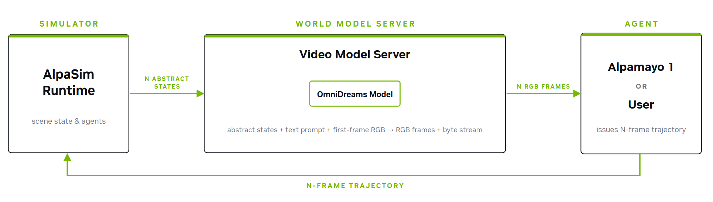
</p>

---

## 📌 项目简介 | Overview

本项目在 **AlpaSim** 闭环仿真框架上部署 NVIDIA **OmniDreams** 动作条件生成式世界模型（2B，
基于 Cosmos-Predict 2.5），打通「**驾驶策略输出控制 → 物理/交通仿真 → 神经渲染下一帧 →
回传驾驶策略**」的 20 s 完整闭环，并在两个阶段逐步推进：

- **Stage 1 — 真实场景闭环**：以真实路采片段（NVIDIA **NuRec** 数据集）为起点，
  Alpamayo R1 / Alpamayo 1.5 作为 driver，完成单 clip 闭环与 **30 场景批量**闭环，
  产出逐帧指标、视频与性能实测。注意 NuRec 在这里**仅提供首帧 RGB、hdmap 与真值轨迹
  等数据，闭环中的每一帧画面均由 OmniDreams 世界模型生成**，并非 NuRec 的三维重建 /
  3DGS 渲染。
- **Stage 2 — 反事实长尾场景**：复现 OmniDreams 论文 §9.3，在**同一个 base scene**
  上通过**文本 prompt + 首帧条件 + 合成 3D 演员注入**（hdmap 拓扑不变，**不重训任何权重**），
  生成 11 个安全关键的长尾变体（暴雪 / 暴雨夜 / 浓雾 / 眩光 / 横穿行人 / 电动轮椅 /
  挖掘机 / 牛 / 施工杂物 / 台风复合）。

## ✨ 特性 | Highlights

- 🔬 **全链路闭环**：六个 gRPC 微服务（controller / driver / physics / trafficsim /
  renderer / …）事件堆驱动，逐跳数据可追溯。
- 🎬 **OmniDreams 2B 蒸馏模型**：704p / 30 fps，2-step FlowMatch，渲染约 110 ms/帧。
- 🗺️ **双视角评测**：前摄合成画面 + AlpaSim BEV 鸟瞰轨迹（对齐论文 §9.4）。
- 🎛️ **HUD 视频**：速度 / 转向 / 障碍距离 / 安全状态实时叠加。
- 📐 **严格可复现**：补丁、配置、manifests 全部入库；逐帧 `metrics.parquet` 为验收依据。

---

## 🏙️ Stage 1：真实场景闭环

Alpamayo 1.5 在 **30 个真实路采片段**（来自 NVIDIA NuRec 数据集；NuRec 只作为
数据源——首帧 / hdmap / 真值轨迹，下方画面全部由 OmniDreams 世界模型渲染，而非
NuRec 重建引擎）上的批量闭环结果（随机展示 6 个；每个 GIF 由 20 s rollout 中均匀
抽取的 10 帧组成）：

<table>
  <tr>
    <td align="center">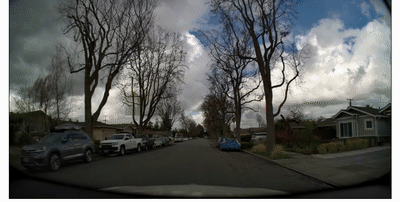</td>
    <td align="center">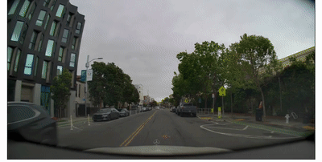</td>
    <td align="center">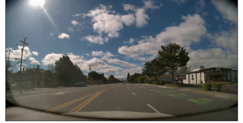</td>
  </tr>
  <tr>
    <td align="center"><sub>clip <code>060131e7</code></sub></td>
    <td align="center"><sub>clip <code>1c7e2423</code></sub></td>
    <td align="center"><sub>clip <code>46252225</code></sub></td>
  </tr>
  <tr>
    <td align="center">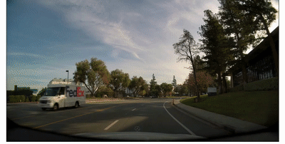</td>
    <td align="center">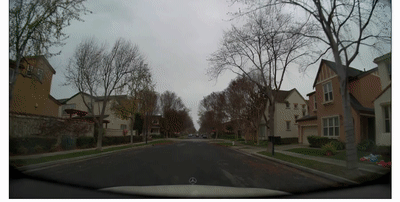</td>
    <td align="center">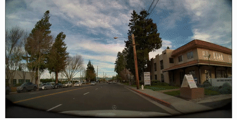</td>
  </tr>
  <tr>
    <td align="center"><sub>clip <code>662bc0b8</code></sub></td>
    <td align="center"><sub>clip <code>86ad21f0</code></sub></td>
    <td align="center"><sub>clip <code>fadc73da</code></sub></td>
  </tr>
</table>

> 📊 批量实测：闭环运行约 0.13× 实时（~3.9 fps，每 step ~2.04 s）；A15 在 30 场景中
> 90% 出现碰撞/offroad——「链路跑通」与「驾驶质量」在报告中严格区分，
> 详见 [`docs/Stage1_Batch30_Report.md`](docs/Stage1_Batch30_Report.md)。

---

## 🌦️ Stage 2：天气 / 光照反事实变体

变体 **v01–v04** 的首帧经图像编辑模型（火山方舟 Seedream 5.0 Pro）编辑，再由文本
prompt 全程传播外观，道路几何与 hdmap 拓扑保持不变。下为 **v00 零干预基线 vs v01–v04**
（每 GIF 均匀抽取 10 帧）：

<table>
  <tr>
    <td align="center">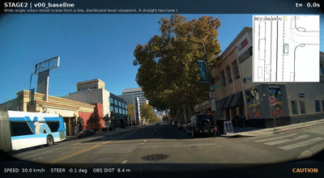</td>
    <td align="center">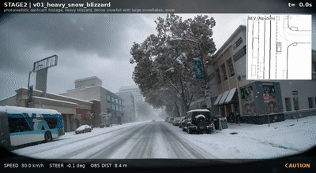</td>
    <td align="center">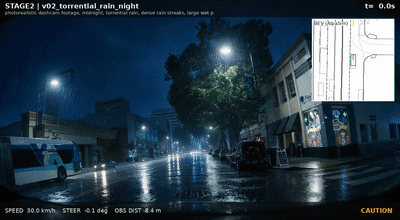</td>
  </tr>
  <tr>
    <td align="center"><sub><b>v00 Baseline</b><br>晴朗白天 · 零干预</sub></td>
    <td align="center"><sub><b>v01 Heavy Snow Blizzard</b><br>暴雪 · 积雪路面</sub></td>
    <td align="center"><sub><b>v02 Torrential Rain @ Night</b><br>深夜暴雨</sub></td>
  </tr>
  <tr>
    <td align="center">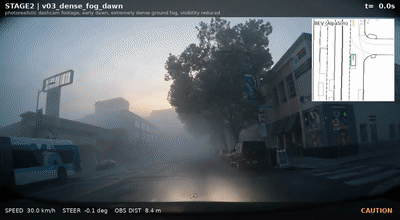</td>
    <td align="center">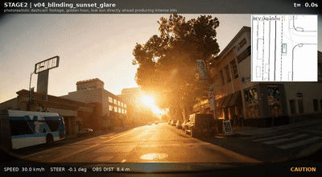</td>
    <td></td>
  </tr>
  <tr>
    <td align="center"><sub><b>v03 Dense Fog @ Dawn</b><br>黎明浓雾</sub></td>
    <td align="center"><sub><b>v04 Blinding Sunset Glare</b><br>日落眩光</sub></td>
    <td></td>
  </tr>
</table>

---

## 🚧 Stage 2：注入合成演员的罕见场景

变体 **v05–v10** 注入带轨迹的合成 3D 演员（首帧锚定 + 每 chunk 局部 latent patch），
driver 需实时应对。下为 **v00 基线 vs v05–v10** 的 HUD 画面前 6 s：

<table>
  <tr>
    <td align="center" width="25%"></td>
    <td align="center" width="25%">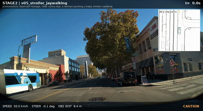</td>
    <td align="center" width="25%"></td>
    <td align="center" width="25%">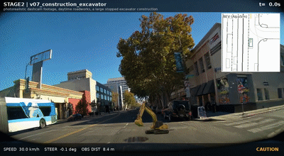</td>
  </tr>
  <tr>
    <td align="center"><sub><b>v00 Baseline</b><br>零干预基线</sub></td>
    <td align="center"><sub><b>v05 Stroller Jaywalking</b><br>推婴儿车行人横穿</sub></td>
    <td align="center"><sub><b>v06 Wheelchair Shoulder</b><br>电动轮椅 · 路肩</sub></td>
    <td align="center"><sub><b>v07 Excavator</b><br>停止的挖掘机</sub></td>
  </tr>
  <tr>
    <td align="center"></td>
    <td align="center"></td>
    <td align="center">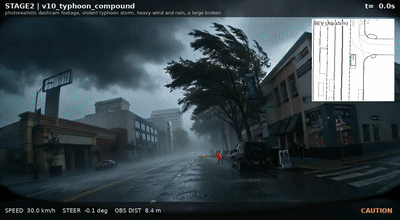</td>
    <td></td>
  </tr>
  <tr>
    <td align="center"><sub><b>v08 Loose Cow</b><br>路上奶牛</sub></td>
    <td align="center"><sub><b>v09 Construction Debris</b><br>桶 + 木箱障碍组</sub></td>
    <td align="center"><sub><b>v10 Typhoon Compound</b><br>台风 · 落枝 · 撑伞行人</sub></td>
    <td></td>
  </tr>
</table>

## ⚠️ 结果解读：有效期与已知局限

长闭环画面在各自时刻后会发生明确的几何/语义崩解，本项目所有事件统计均按
**有效期（valid window）截断**（见 `configs/stage2/manifests/stage2_v05v10_valid_windows.csv`）：

| 现象 | 说明 |
|---|---|
| 🅰️ **演员诱发巨型化** | 世界模型在粘贴资产外自发生成更大的「续演体」并自回归放大；OOD 越强寿命越短（v07 ≈ 2 s，v08–v10 ≈ 5 s）。 |
| 🅱️ **渲染器固有漂移** | v00 零干预基线在 ≈ 6.6 s 后同样出现树干巨型化/车辆融化——每次实验必须同跑 v00 以区分两类现象。 |
| 🌦️ **天气 prompt 边界** | prompt 成功改变外观，但部署的 distilled checkpoint 对「仅 prompt」条件的动作通道不敏感（已 A/B 验证），不夸大为「模型在暴雪下驾驶」。 |

## 🚀 快速复现

```bash
# Stage 1：单 clip / 30 场景批量
bash scripts/run_closed_loop_a15.sh
bash scripts/run_batch_a15.sh

# Stage 2：11 变体串行闭环（先手动启动 renderer，详见指南）
bash scripts/run_stage2_separate.sh
```

| 文档 | 内容 |
|---|---|
| [`docs/Stage1_Reproduction_Guide.md`](docs/Stage1_Reproduction_Guide.md) | **Stage 1 从零复现**：环境、补丁、镜像、单次/批量 |
| [`docs/Stage2_Reproduction_Guide.md`](docs/Stage2_Reproduction_Guide.md) | **Stage 2 端到端复现**：补丁、方舟权限办理、cutout、11 变体、验收 |
| [`docs/Stage1_Architecture.md`](docs/Stage1_Architecture.md) | 代码级架构：六个 gRPC 服务、事件堆闭环时序 |
| [`docs/Stage2_Complete.md`](docs/Stage2_Complete.md) | Stage 2 完整复盘：方法、妥协、踩坑 |

## 📄 Citation

如本项目对你的研究有帮助，请引用 OmniDreams 原论文：

```bibtex
@article{omnidreams2026,
  title   = {NVIDIA OmniDreams: Real-Time Generative World Model for Closed-Loop Autonomous Vehicle Simulation},
  author  = {Basant, Aarti and Kar, Amlan and Paschalidou, Despoina and Wei, Fangyin and
             Ferroni, Francesco and Garcia Cobo, Guillermo and Turki, Haithem and Ling, Huan and
             Seo, Jaewoo and Lucas, James and Wu, Jay Zhangjie and Wang, Jialiang and
             Lorraine, Jonathan and Gao, Jun and He, Kai and Tothova, Katarina and Xie, Kevin and
             Tyszkiewicz, Michal and Wu, Qi and de Lutio, Riccardo and Li, Ruilong and
             Fidler, Sanja and Kim, Seung Wook and Shen, Tianchang and Cao, Tianshi and
             Pfaff, Tobias and Lew, William and Wu, Xindi and Ren, Xuanchi and Lu, Yifan and
             Zhang, Yuxuan and Gojcic, Zan and Wang, Zian},
  journal = {arXiv preprint arXiv:2606.03159},
  year    = {2026}
}
```

## 🙏 Acknowledgements

本项目基于 NVIDIA 研究成果构建：[**OmniDreams**](https://github.com/nv-tlabs/omni-dreams)
（动作条件生成式世界模型）、[**AlpaSim**](https://github.com/NVlabs/alpasim)（闭环仿真编排）
与 **Alpamayo** 驾驶模型；Stage 2 首帧编辑与演员素材由火山方舟
Seedream 5.0 Pro（`doubao-seedream-5-0-pro-260628`）生成，演员抠图使用
[BiRefNet](https://github.com/ZhengPeng7/BiRefNet)。

<div align="center">
<br>
<sub>📹 页面全部 GIF 均来自本项目实际闭环运行产物 · Built with <a href="https://claude.com/claude-code">Claude Code</a></sub>
</div>
